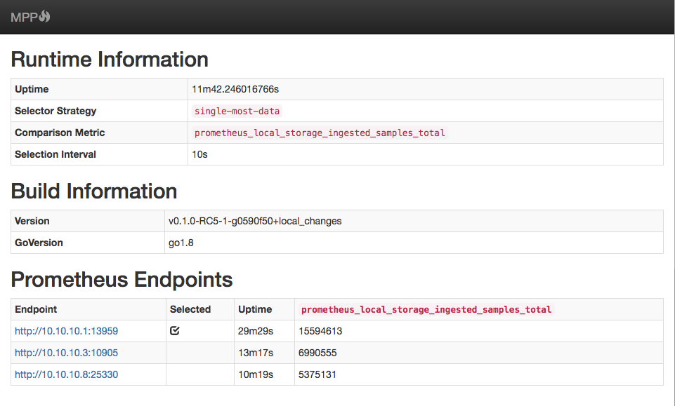

mpp
===

[](https://travis-ci.org/matt-deboer/mpp)
[](https://hub.docker.com/r/mattdeboer/mpp/)
<!-- [](https://coveralls.io/github/matt-deboer/mpp?branch=master) -->

Multi-prometheus proxy (**mpp**) exists to forward incoming query requests to one of a set
of multiple prometheus instances deployed as HA duplicates of each other.


Motivation
---

As the recommended pattern for running Prometheus in HA mode is to [run duplicate instances](https://github.com/prometheus/prometheus/issues/1500)
(same configuration, scraping the same targets independently), a method is needed to route queries
appropriately between those instances to provide a seemless experience for clients when individual
instance failures occur.

How it works
---

MPP acts as a proxy sitting in front of multiple prometheus instances, choosing one or more instances
to receive requests based on a configurable selector strategy. Candidate instances are found using
a configured _locator_ mechanism, of which Marathon, Kubernetes and endpoints file are supported.

Request are buffered and retried (up to 2 times), and a re-selection is performed in process after the
first failure for a given request--which should result in seemless failover, assuming a viable backend
candidate is available.

Discovery
---

Prometheus endpoints can be discovered via the Marathon API, the Kubernetes API, or by providing an
endpoints file which is scanned on a regular interval.

**Marathon** discovery is configured using:

- `--marathon-url`: The marathon API endpoint to contact
- `--marathon-apps`: A comma-separated list of apps to query for endpoints
- `--marathon-principal-secret`: (optional) A DCOS principal-secret object used to authenticate to Marathon
- `--marathon-auth-endpoint`: (optional) Overrides the auth-endpoint contained within the principal secret object

**Kubernetes** discovery is configured using:

- `--kubeconfig`: (optional) The path to the kubeconfig file used to locate the cluster and authenticate; if not specified,
  in-cluster config will be used
- `--kube-namespace`: The namespace in which the pods/endpoints exist
- `--kube-service-name`: The name of a service whose endpoints will be used to locate prometheus
- `--kube-pod-label-selector`: A pod-selector string used to locate the pods containing the endpoints
- `--kube-port`: The port for pods/endpoints on which prometheus is lisetening; if not specified, the
  first TCP port found will be used

**Endpoints file** discovery is configured using:

- `--endpoints-file` -- the path to a file containing one endpoint per line.

Selection
---

Traffic is routed based on the chosen `--routing-strategy`:

- `single-most-data`: This strategy always routes traffic to a single prometheus endpoint, determined
  by whichever endpoint contains the _most_ data, measured by total ingested samples count.

- `minimum-history:{min-history-duration}`: This strategy routes traffic to a randomly selected prometheus endpoint having
  at least M of sample history.

- `random`: This strategy routes traffic to a randomly selected prometheus endpoint.

Session Affinity
---

Stickiness is configured via the `--affinity-options` flag, which accepts a comma-separated
list of one or more of the options:

- `cookies`: (endabled by default) Sets a cookie on the first request and uses that in subsequent requests to route
  to the same backend.
- `sourceip`: Examines the `X-Forwarded-For` header, falling back to the actual source IP; the chosen route is stored
  in an LRU-based cache for that value.


Health
---

The proxy responds with `OK` to requests on the `/mpp/health` path.

Metrics
---

Prometheus-formatted metrics are available at the `/mpp/metrics` path.

Full Usage
---

```text
NAME:
   mpp - Launch a dynamically configured proxy over multiple prometheus endpoints
    which selects endpoints based on configurable criteria.


USAGE:
   mpp [global options] command [command options] [arguments...]

VERSION:
   v0.2.0-a2

COMMANDS:
     help, h  Shows a list of commands or help for one command

GLOBAL OPTIONS:
   --kubeconfig value                 The path to a kubeconfig file used to communicate with the kubernetes api server
                                            to locate prometheus instances [$MPP_KUBECONFIG]
   --kube-service-name value          The service name used to locate prometheus endpoints; take precedence over 'kube-pod-label-selector' [$MPP_SERVICE_NAME]
   --kube-pod-label-selector value    The label selector used to find prometheus pods [$MPP_KUBE_POD_LABEL_SELECTOR]
   --kube-namespace value             The namespace in which prometheus pods/endpoints exist [$MPP_KUBE_NAMESPACE]
   --kube-port value                  The port (name or number) where prometheus is listening on individual pods/endpoints [$MPP_KUBE_PORT]
   --marathon-url value               The URL for the marathon API endpoint used to locate prometheus instances [$MPP_MARATHON_URL]
   --marathon-apps value              A comma-separated list of marathon app IDs whose tasks will be queried for
                                            prometheus endpoints [$MPP_MARATHON_APPS]
   --insecure value, -k value         Whether connections to https endpoints with unverifiable certs are allowed [$MPP_INSECURE_CERTS]
   --marathon-principal-secret value  The principal secret used to handle authentication with marathon [$MPP_MARATHON_PRINCIPAL_SECRET]
   --marathon-auth-endpoint value     The authentication endpoint to use with the 'marathon-principal-secret', overriding the value
                                            contained within the secret [$MPP_MARATHON_AUTH_ENDPOINT]
   --endpoints-file value             A file path containing a list of endpoints to use, one per line. This file is re-read at every
                                            selection interval [$MPP_ENDPOINTS_FILE]
   --routing-strategy value           The strategy to use for choosing viable prometheus enpoint(s) from those located;
                                            valid choices include: 'single-most-data', 'random', 'minimum-history' (default: "single-most-data") [$MPP_ROUTING_STRATEGY]
   --selection-interval value         The interval at which selections are performed; note that selection is
                                            automatically performed upon backend failures (default: "10s") [$MPP_SELECTION_INTERVAL]
   --affinity-options value           A comma-separated list of sticky-session modes to enable, of which 'cookies', and 'sourceip'
                                            are valid options (default: "cookies") [$MPP_AFFINITY_OPTIONS]
   --port value                       The port on which the proxy will listen (default: 9090) [$MPP_PORT]
   --verbose, -V                      Log debugging information [$MPP_VERBOSE]
   --help, -h                         show help
   --version, -v                      print the version
```

Status Page
---

The proxy displays a status summary (see below) on the `/mpp/status` path.

  


